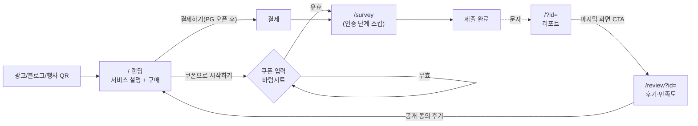
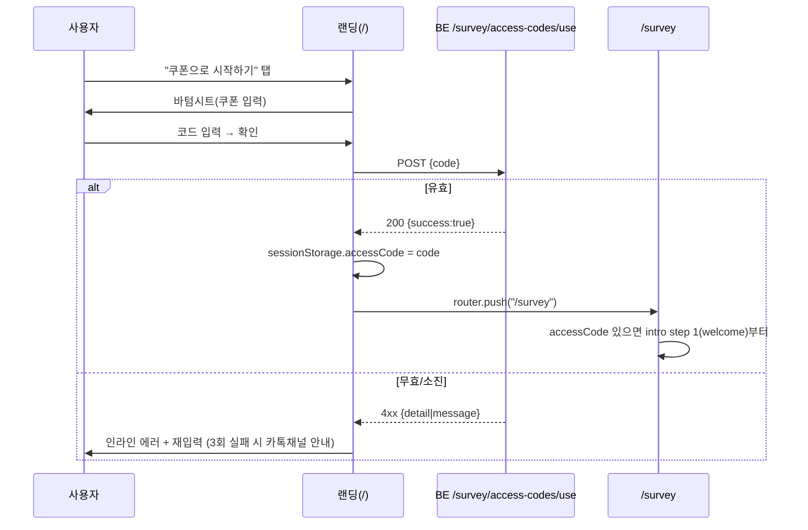

# 우리둘 — 랜딩 · 후기 · 쿠폰 기획서 (v0.1)

> 작성일 2026-09-07 · 작성 jihye · 상태 **초안(개발 착수용)**
> 대상 저장소 `wedding-report-frontend` (Next.js 16 / React 19 / Tailwind 4 / jotai)
> 참고 원본: 아임웹 `꽃-길` 사이트(B급 컨셉) → `docs/plan/images/ref-imweb-*.png`

---

## 0. 한 장 요약

| 항목 | 내용 |
| --- | --- |
| 배경 | PG(토스페이먼츠) 카드사 심사까지 4~6주 소요. 그 사이 **쿠폰 번호로 결제를 대체**해 판매·행사 진행. PG 심사에도 “상품이 노출된 판매 페이지”가 필요하므로 랜딩이 선행 과제. |
| 산출물 | ① 서비스 설명·구매 랜딩(`/`) ② 후기·만족도 페이지(`/review`) ③ 쿠폰 번호 입력(랜딩 CTA → 설문 진입) |
| 원칙 | 기존 설문·리포트 코드는 **그대로 두고 앞뒤에 붙인다.** 새 의존성 0개. 기존 인증코드 API 재사용. |
| 완료 기준 | 랜딩에서 쿠폰 입력 → 설문 → 리포트 → 후기 제출까지 한 번에 통과. GA4에 각 단계 이벤트가 찍힘. |

---

## 1. 현재 구조(AS-IS) → 변경 구조(TO-BE)

### 1.1 AS-IS

- 라우트는 `/` 하나. `?id=` 있으면 리포트, 없으면 설문.
- 설문 첫 화면이 **5자리 인증코드 입력**(`POST /survey/access-codes/use`). 코드는 카톡 등으로 수동 전달.
- 설문 완료 → 문자로 리포트 링크(`/?id=xxxx`) 발송.
- 서비스 설명·가격·후기 화면 **없음**. 결제 없음.

### 1.2 TO-BE



### 1.3 라우팅

| 경로 | 화면 | 비고 |
| --- | --- | --- |
| `/` | **랜딩** (id 없을 때) | `?id=` 있으면 지금처럼 리포트 렌더 → **기존 문자 링크 호환 유지** |
| `/survey` | 설문 (현 `app/page.tsx`의 SurveyPage 이동) | `sessionStorage.accessCode` 있으면 step 0(인증) 건너뜀 |
| `/review` | 후기·만족도 | `?id=` 필수. 없으면 랜딩으로 |
| `/terms`, `/privacy`, `/refund` | 약관 3종 | PG 심사 필수. 정적 텍스트 페이지 |

> `/?id=`를 `/report?id=`로 옮기지 않는 이유: 이미 발송된 문자 링크가 깨짐. 리다이렉트 한 줄로 해결 가능하지만 굳이 지금 할 일이 아님.

---

## 2. 랜딩 페이지 (`/`)

### 2.1 방향

**아임웹에 이미 있는 상품 페이지(`커플 결혼시뮬레이션 - 우리둘 테스트`, 19,000원)를 자체 웹으로 이식**한다. 카피·이미지·섹션 순서는 그대로 가져오고, 아임웹 결제 버튼 자리에 **쿠폰 CTA**, 끝에 **후기 섹션·푸터**를 붙인다. 새로 기획하는 게 아니라 “이미 검증된 페이지 + 3가지 추가”.

- 톤: 아임웹 꽃-길 B급 손그림. 선글라스 캐릭터, 형광 손글씨 헤드라인, 파스텔 배경, 섹션 사이 `|` 구분선과 짧은 대사체 문장.
- 컬러: 기존 브랜드 `#FF9080` · `#FFD4BC` · `#4FBFA0`(3단계 섹션 민트 타원과 동일 계열) + 강점 섹션 노랑 `#F7C948`.
- 폰트: Pretendard(이미 로드). 손글씨 헤드라인은 이미지.
- 이미지는 **아임웹 관리자에서 원본 export** → `public/images/landing/`. AI 생성은 없는 것만(2.4).

참고 캡처

| 파일 | 내용 |
| --- | --- |
| `images/ref-imweb-product-full.png` | 상품 페이지 전체(Step3까지, 이하 잘림) |
| `images/ref-imweb-product-hero.png` | 히어로 + 가격바 |
| `images/ref-imweb-product-steps.png` | 3단계 타원 섹션 |
| `images/ref-imweb-product-points.png` | 강점 3개 노란 섹션 |
| `images/ref-imweb-hero.png` / `-roadmap.png` | 꽃-길 홈 (톤 참고) |
| `images/ref-imweb-footer.png` | 푸터 사업자 고지 |

### 2.2 섹션 구성 (아임웹 순서 유지, ★ = 신규)

```
┌──────────────────────────────┐
│ [logo 우리둘]   19,000원 [쿠폰으로 시작]│ ★ sticky 바 (아임웹 "총 상품금액 / 구매하기" 바 대체)
├──────────────────────────────┤
│ ① HERO (분홍 하트 배경)         │
│   나만그래?                    │
│  "우리 자기는 다 좋은데…"        │  ← 말풍선 + 머리 감싼 캐릭터 (아임웹 원본 그대로)
│  [ 쿠폰으로 시작하기 ]  ★        │
├──────────────────────────────┤
│ ② 작가 한마디                   │
│  하… 진짜 답답해서 제가 직접 만들었습니다.│
│  이름하여 [꽃길리포트].           │
├──────────────────────────────┤
│ ③ 3단계 (민트 타원)             │
│  복잡한 건 질색이라, 딱 3단계 구성  │
│  STEP1 사전설문 120문항 (폰 캡처) │
│  STEP2 발송대기 최대 30분 (커플 일러스트)│
│  STEP3 리포트 열람 모바일 40페이지 │
├──────────────────────────────┤
│ ④ 준비물                       │
│  준비물? 그냥 나랑 짝꿍, 핸드폰만!  │
│  [카페 커플 일러스트]            │
│  문항이 120개라 많다고… 시간 순삭   │
├──────────────────────────────┤
│ ⑤ 반전                         │
│  성격 테스트인 줄 알았는데 정신 차리고│
│  읽어보니 1년 뒤 밥 차려먹는 걸로   │
│  싸우고 있는 모습을 보여주더라고요?  │
│  [설문 화면 폰 목업]             │
│  아니, 리포트가 무슨 전공 서적급…40페이지│
├──────────────────────────────┤
│ ⑥ 강점 3개 (노란 배경 + 캐릭터)   │
│  강점1 관계 분석에 특화된 심리테스트로 시작│
│  강점2 성격 차이부터 현실 문제까지 생생한 시뮬레이션│
│  강점3 갈등은 줄이고 연결은 끈끈하게 만드는 꽃길 로드맵│
├──────────────────────────────┤
│ ⑦ 리포트 미리보기                │
│  이렇게 알찬 구성의 리포트.. 안 하고 그냥 갈 수 있어요?│
│  Step1 개인성향 분석 (캡처 그리드) │
│  Step2 상호작용분석               │
│  Step3 시뮬레이션                │
│  Step4 관계 지표 / Step5 종합 결론 │  ← 캡처에 잘려 미확인. 없으면 추가
│  ★ 캡처 탭 → 확대 보기(lightbox, <dialog>)│
├──────────────────────────────┤
│ ⑧ 후기 ★                       │
│  가로 스와이프 카드: ★★★★★ 한줄 · 김○○│
│  (v0.1 하드코딩 3~5개 → /review 공개동의분)│
├──────────────────────────────┤
│ ⑨ 구매 카드 ★                   │
│  커플 결혼시뮬레이션 - 우리둘 테스트 │
│  2인 1세트 · 웹 열람 · 재열람 무제한│
│  19,000원 (VAT 포함)  SALE 뱃지   │
│  [ 쿠폰으로 시작하기 ]            │
│  [ 카드 결제하기 ] disabled "결제 준비중"│
│  환불 규정 1줄 + 링크             │
├──────────────────────────────┤
│ ⑩ FAQ (아코디언 5) ★            │
├──────────────────────────────┤
│ ⑪ 푸터 (아임웹 푸터 문구 그대로) ★ │
└──────────────────────────────┘
```

- 모바일 1열, PC는 기존 `wrapper`(max-width 500px 중앙)와 동일. 아임웹 좌측 메뉴는 이식하지 않음.
- 스크롤 인터랙션 없음. 섹션은 이미지+텍스트 정적 구성. (아임웹과 동일한 체감이면 충분)

### 2.3 카피

①~⑦은 **아임웹 문구 그대로**(위 와이어프레임에 옮겨 적음). 신규 문구만:

| 위치 | 카피 |
| --- | --- |
| CTA | 쿠폰으로 시작하기 / (PG 후) 결제하고 시작하기 |
| 후기 ⑧ 헤더 | 먼저 해본 커플들은요 |
| 구매 ⑨ | 커플 결혼시뮬레이션 - 우리둘 테스트 · 2인 1세트 · 모바일 40페이지 · 재열람 무제한 |
| FAQ | 혼자 해도 되나요? / 결과는 언제 오나요? / 상대가 안 하면? / 환불되나요? / 개인정보는? |
| 결제 버튼 disabled 안내 | 카드 결제는 준비 중이에요. 쿠폰 문의는 카톡 채널로! |

> ⚠ 문구 불일치: 아임웹 STEP2 “발송대기 최대 30분” vs 설문 완료 화면 “최대 1시간 이내”. 하나로 통일 필요(D-2).

### 2.4 이미지

**아임웹에서 export해 재사용** (AI 생성 불필요)

| # | 에셋 | 섹션 |
| --- | --- | --- |
| E-1 | 히어로 배경(하트) + 말풍선 + 머리 감싼 캐릭터 | ① |
| E-2 | STEP1/3 폰 목업, STEP2 커플 일러스트 | ③ |
| E-3 | 카페 커플 일러스트 | ④ |
| E-4 | 설문 화면 폰 목업 | ⑤ |
| E-5 | 강점 섹션 손 내민 캐릭터 | ⑥ |
| E-6 | 리포트 캡처 Step1~3 그리드 | ⑦ |

**새로 필요** (외부 AI 생성 또는 실캡처)

공통 프롬프트: `black-and-white hand-drawn line art character wearing sunglasses, thick marker outline, minimal shading, white background, korean webtoon doodle style, flat, no text`

| # | 용도 | 규격 | 내용 |
| --- | --- | --- | --- |
| I-1 | 리포트 캡처 Step4·5 | 실기기 캡처 | `?id=DESIGN`으로 4·5장 캡처 (아임웹에 있으면 export) |
| I-2 | 후기 섹션 캐릭터 | 400×400 | 별 5개 들고 웃는 캐릭터 |
| I-3 | 쿠폰 티켓 삽화 | 600×300 | 점선 티켓 + 하트 도장. 쿠폰 바텀시트 상단 |
| I-4 | OG 이미지 | 1200×630 | E-1 히어로 재조합 |

## 3. 쿠폰 번호 입력 (결제 대체)

### 3.1 흐름



### 3.2 화면 (바텀시트)

```
┌──────────────────────────────┐
│ ──                           │
│  [쿠폰 티켓 삽화 I-3]          │
│  쿠폰 번호를 입력해 주세요        │
│  행사장·카톡으로 받으신 번호예요    │
│  ┌────────────────────────┐  │
│  │  L O V E 1             │  │ ← 대문자 자동 변환, 공백/하이픈 제거
│  └────────────────────────┘  │
│  ⚠ 유효하지 않은 쿠폰이에요       │ ← 에러 시
│  [        확인        ]       │ ← 길이 미달/로딩 중 disabled
│  쿠폰이 없으신가요? → 카톡 문의    │
└──────────────────────────────┘
```

- 입력 규칙: 영문·숫자만, **5~8자** 허용(현 코드 5자리. 쿠폰 길이 늘어날 수 있어 상한만 둠). `maxLength=8`, `autoCapitalize="characters"`, `inputMode="text"`.
- 성공: 토스트 “쿠폰이 확인됐어요” → `/survey`.
- 실패 메시지는 서버 `detail`/`message` 그대로. 없으면 “유효하지 않은 쿠폰이에요”.
- 네트워크 실패: “잠시 후 다시 시도해 주세요” + 확인 버튼 재활성.

### 3.3 기존 인증 단계와의 관계

- `/survey` 직접 진입(기존 카톡 코드 배포 경로)은 **그대로 step 0 인증 화면** 노출 → 하위 호환.
- 랜딩 경유 시 `sessionStorage.accessCode`가 있으면 step 1부터 시작. 검증 로직은 `verifyAccessCode()` 한 곳만 사용.
- 주의: 현 API는 “검증 = 사용 처리(카운트 증가)”. 랜딩에서 확인 후 설문을 안 하면 1회 소진됨. **v0.1에서는 감수**(쿠폰은 다회 사용 가능 코드로 발급). 정확한 소진이 필요해지면 BE에 `verify`(조회)와 `use`(설문 제출 시) 분리 요청.

### 3.4 BE 요청 사항 (선택)

| 항목 | 내용 | 필수 |
| --- | --- | --- |
| 응답 필드 추가 | `{ success, message, code_type: "coupon"\|"event", remaining? }` — GA 파라미터용 | 선택 |
| 관리자 콘솔 | 쿠폰 발급(prefix·수량·만료·최대 사용횟수) + 사용 로그 | 운영에 필요. 기존 access-code 관리 화면 재사용 |
| verify/use 분리 | 3.3 참고 | 추후 |

---

## 4. 후기 · 만족도 페이지 (`/review?id=`)

### 4.1 목적

- 행사 보고·마케팅에 쓸 **정량 데이터**(만족도·추천의향·유입경로)와 **정성 데이터**(한 줄 후기, 공개 동의).
- 후기 작성 인센티브: 회의(9/3) 결정대로 **5,000원 쿠폰** → 완료 화면에서 안내(발송은 수동/문자).

### 4.2 진입점

1. 리포트 마지막 화면(`ResultViewerPage` `finish` 스텝) 하단 CTA “1분 후기 남기고 5,000원 쿠폰 받기”.
2. 리포트 발송 문자에 `/review?id=` 링크 한 줄 추가(BE 문자 템플릿 수정 요청).
3. 행사장 QR: `/review?id=EVENT-<행사코드>` — id가 `EVENT-`로 시작하면 설문 연결 없이 행사 응답으로 저장.

### 4.3 문항 (총 6개, 1분 이내)

| # | 문항 | 타입 | 필수 | 컴포넌트 |
| --- | --- | --- | --- | --- |
| Q1 | 리포트 전체 만족도 | 별점 1~5 | ✔ | `RatingSelector` 재사용(라벨 “별로예요/최고예요”) |
| Q2 | 친구·연인에게 추천할 의향 | 0~10 (NPS) | ✔ | 숫자 버튼 11개 (`SelectionCircle` 재사용) |
| Q3 | 가장 좋았던 파트 | 다중 선택 5개 | ✔ | `AnswerButton` 재사용 (1 성향 / 2 4영역 / 3 36개월 / 4 지표 / 5 결론) |
| Q4 | 한 줄 후기 | 텍스트 (≤200자) | ✔ | `TextAreaField` rows=3 |
| Q5 | 후기 공개 동의 | 체크 | – | “닉네임(이름 첫 글자+○○)으로 랜딩에 실려도 괜찮아요” |
| Q6 | 어떻게 알게 됐나요 | 단일 선택 | – | 인스타 / 블로그 / 지인 / 행사장 / 기타 |

- 리포트 정확도 체감(“얼마나 맞았나요”)은 Q1과 상관 높아 **제외**. 필요하면 Q1 라벨로 흡수.
- 연락처는 다시 받지 않음. `id`로 설문 레코드의 휴대폰과 연결(EVENT- 응답만 선택 입력).

### 4.4 화면

```
┌──────────────────────────────┐
│ [logo]                       │
│ 리포트, 어땠어요?              │
│ 1분이면 끝나요 · 5,000원 쿠폰 🎁 │
│                              │
│ Q1 전체 만족도                 │
│  ★ ★ ★ ★ ★                  │
│ Q2 추천 의향 (0~10)            │
│  ⓪①②③④⑤⑥⑦⑧⑨⑩              │
│ Q3 좋았던 파트 (여러 개)        │
│  [성향][4영역][36개월][지표][결론]│
│ Q4 한 줄 후기                  │
│  ┌────────────────────────┐  │
│  │                        │  │
│  └────────────────────────┘  │
│  ☐ 후기를 랜딩에 실어도 괜찮아요  │
│ Q6 알게 된 경로 (선택)          │
│  [인스타][블로그][지인][행사][기타]│
│                              │
│ [        제출하기        ]     │ ← 필수 미완 시 disabled
└──────────────────────────────┘
       ↓ 제출 후
┌──────────────────────────────┐
│  고마워요 🌸                  │
│  5,000원 쿠폰은 등록된 번호로    │
│  2일 안에 문자로 보내드려요       │
│  [ 우리둘 다른 커플에게 알리기 ]  │ ← navigator.share / 링크 복사
│  [ 리포트 다시 보기 ]           │
└──────────────────────────────┘
```

- 중복 제출: 같은 `id`로 재진입 시 “이미 후기를 남기셨어요” + 완료 화면. `localStorage.reviewed_<id>` + 서버 409.
- `id` 없거나 리포트 조회 실패 → 랜딩으로 리다이렉트.

### 4.5 API

```
POST /survey/reviews
{
  "survey_id": "abc123",          // 또는 "EVENT-2026SEOUL"
  "rating": 5,                    // 1~5
  "nps": 9,                       // 0~10
  "best_parts": ["part3","part5"],
  "comment": "…",                 // ≤200
  "public_consent": true,
  "source": "instagram" | "blog" | "friend" | "event" | "etc" | null,
  "phone": "010…"                 // EVENT- 응답에서만, 선택
}
→ 201 { "success": true }
→ 409 { "detail": "이미 후기를 작성했습니다." }

GET /survey/reviews/public?limit=10
→ [{ "nickname": "김○○", "rating": 5, "comment": "…", "created_at": "…" }]
   // 랜딩 후기 섹션. v0.1은 하드코딩 → BE 준비되면 교체
```

관리자 집계(BE 요청): 기간별 평균 rating · NPS(추천 9~10 비율 − 비추천 0~6 비율) · best_parts 분포 · source 분포 · 공개동의 후기 목록 CSV.

---

## 5. 트래킹 (GA4, 기존 `track()`/`useScreen()` 사용)

| 이벤트 | 파라미터 | 시점 |
| --- | --- | --- |
| `page_view` | `/landing`, `/landing/coupon`, `/review`, `/review/done` | `useScreen` |
| `landing_cta_click` | `section: hero\|product\|sticky` | CTA 탭 |
| `landing_section_view` | `section: 2..7` | IntersectionObserver 50% |
| `roadmap_open` | `part: 1..5` | 팻말 탭 |
| `coupon_submit` | – | 확인 탭 |
| `coupon_success` / `coupon_invalid` | `reason` | 응답 |
| `survey_step` | 기존 | 인증 스킵 시 `step: welcome`부터 |
| `review_submit` | `rating, nps, source` | 제출 |
| `review_share_click` | – | 공유 버튼 |

핵심 퍼널: `landing → coupon_success → survey_submit → report_view → review_submit`.

---

## 6. 개발 작업 분해

| 순서 | 작업 | 파일 | 규모 |
| --- | --- | --- | --- |
| 1 | 설문을 `/survey`로 이동. `/`는 id 없으면 랜딩 | `app/page.tsx` → `app/survey/page.tsx` 이동, `app/page.tsx`에 `<LandingPage/>` 분기 | S |
| 2 | 인증 스킵 | `pages/survey/IntroductionPage.tsx` 초기 step: `sessionStorage.accessCode ? 1 : 0` (useIntroduction의 introStepAtom 초기화) | XS |
| 3 | 쿠폰 바텀시트 | `components/CouponSheet.tsx` — `verifyAccessCode` 호출, 성공 시 push. 바텀시트는 `<dialog>` + Tailwind, 라이브러리 없음 | S |
| 4 | 랜딩 페이지 | `pages/landing/LandingPage.tsx` + 섹션 컴포넌트는 같은 파일 내 함수로. 이미지 `public/images/landing/` | L |
| 5 | 약관 3종 | `app/(legal)/terms|privacy|refund/page.tsx` — 텍스트는 경영지원 전달본 | S |
| 6 | 후기 페이지 | `app/review/page.tsx` + `pages/review/ReviewPage.tsx`, `utils/api.ts`에 `submitReview()` | M |
| 7 | 리포트 finish 스텝 CTA | `pages/result/ResultViewerPage.tsx` finish 분기에 버튼 1개 | XS |
| 8 | GA 이벤트 | 각 파일 내 `track()` 호출 | XS |
| 9 | 메타/OG | `app/layout.tsx` metadata + `public/og.png` (I-1 기반) | XS |

- 예상 공수: FE 4~5일(이미지 확보 전제). 이미지 없이도 1~4·6·7은 진행 가능(placeholder 박스).
- 병렬 가능: BE는 4.5 API·문자 템플릿·쿠폰 발급 콘솔, 디자인은 2.4 이미지.

### 수용 기준(QA)

- [ ] `/?id=DESIGN` 리포트 여전히 열림
- [ ] `/survey` 직접 진입 시 인증 화면 그대로
- [ ] 랜딩 쿠폰 성공 → `/survey` welcome부터, 새로고침해도 유지(sessionStorage)
- [ ] 잘못된 쿠폰 3회 → 카톡 문의 링크 노출
- [ ] `/review?id=DESIGN` 제출 → 완료 화면, 재진입 시 완료 화면
- [ ] 푸터 사업자 정보·약관 3링크 200 응답(심사 체크리스트)
- [ ] 375px·PC에서 가로 스크롤 없음, 히어로 LCP 이미지 ≤ 200KB

---

## 7. 미결 사항 (결정 필요)

| # | 항목 | 담당 | 비고 |
| --- | --- | --- | --- |
| D-1 | 판매가 | ✅ 확정 | 아임웹 기준 19,000원. 정가(SALE 전) 표기 여부만 확인 |
| D-2 | 발송 대기 문구 통일 | 운영 | 아임웹 “최대 30분” vs 앱 “최대 1시간”. 실제 처리 시간 기준으로 하나 선택 |
| D-3 | 쿠폰 코드 정책 (길이·다회 사용·만료) | 운영/BE | 3.3 소진 이슈와 연결 |
| D-4 | 5,000원 쿠폰 발송 방식 | 운영 | 수동 문자 vs BE 자동 |
| D-5 | 약관·환불 규정 문안 | 경영지원 | 표준 약관 기반 |
| D-6 | 문의 채널 (카톡채널 URL) | 운영 | 쿠폰 없음/에러 시 링크 |
| D-7 | 도메인 | 경영지원 | 통신판매업 신고·PG 심사에 필요 |
| D-8 | 아임웹 상품 페이지 이미지 원본 export | 디자인 | 2.4 E-1~E-6. 없으면 캡처에서 크롭 |
| D-9 | 리포트 미리보기 Step4·5 존재 여부 | 마케팅 | 캡처가 Step3에서 잘림 |

---

## 부록 A. 아임웹 → 자체 웹 대응표

| 아임웹 상품 페이지 | 자체 랜딩 |
| --- | --- |
| 상단 “총 상품금액 19,000원 / 구매하기” 바 | sticky 바 “19,000원 / 쿠폰으로 시작” |
| 히어로~리포트 미리보기(①~⑦) | 그대로 이식 |
| 아임웹 결제 | 쿠폰 입력 바텀시트 (PG 오픈 후 카드 결제 버튼 활성) |
| 좌측 메뉴 / Mypage / Login | 없음 |
| (없음) | 후기 · 구매 카드 · FAQ 신규 |
| 푸터 사업자 고지 | 동일 문구 |

## 부록 B. 파일 위치

```
docs/plan/
├── 우리둘_랜딩_후기_쿠폰_기획서.md   ← 이 문서 (노션에 붙여넣기)
└── images/
    ├── ref-imweb-product-full.png    우리둘 상품 페이지 전체(축소)
    ├── ref-imweb-product-hero.png    히어로 + 가격바
    ├── ref-imweb-product-steps.png   3단계 섹션
    ├── ref-imweb-product-points.png  강점 3개 섹션
    ├── ref-imweb-full.png            꽃-길 홈 전체(축소)
    ├── ref-imweb-hero.png            꽃-길 히어로
    ├── ref-imweb-roadmap.png         꽃-길 로드맵
    ├── ref-imweb-footer.png          푸터
    └── ref-imweb-nav.png             메뉴
```
